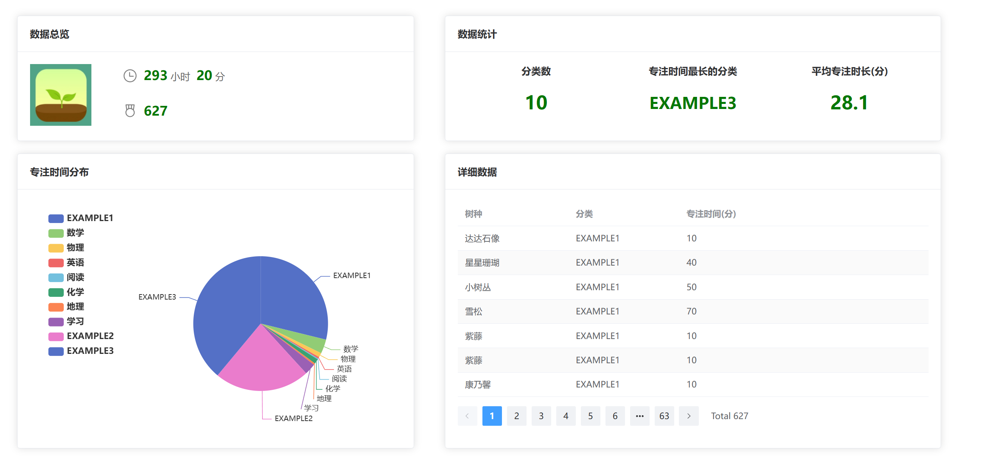

# Forest-Dashboard-New
***
#### 项目简介  
**V1.1更新 2023.7.15**  
* 移除了详细数据模块，应用不再需要数据库支持    
* 修复了bug    

 
**V1.0 2023.7.12**  
* 第一个版本

**效果**  
  
**使用教程：**
```
https://www.bilibili.com/video/BV1jW4y1o75w
```
**作用**：使用官方API接口，快速地将您所有的Forest专注数据可视化，解决了APP中只能统计某一年数据的问题。  
**PS**：本项目是我第一个springboot项目的改进版，代码上存在着诸多问题，还请各位大佬们多多指教。
#### ·技术栈
前端：Vue3+ECharts+axios+element-plus    
后端：Springboot+~~Mybatis~~+~~MYSQL~~+Tomcat
***
#### ·使用指南
**可以直接启动应用啦~**  
*注意：打包好的项目文件中已指定数据库端口等信息，请前往源代码查看。此外，服务器将占用默认端口8080，您可以使用下方url来访问服务：*
```
localhost:8080
```
*注意：如需切换账号，请重启服务。*

    